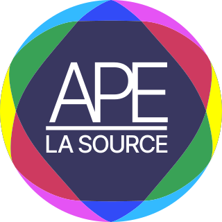

<style>
  code {
    display: inline-block;
    padding: 0.2em 0.3em;
  }
  code.cobalt {
     color: #fff;
     background: #0055a4;
  }
  code.orange {
     color: #fff;
     background: #f6b027;
  }
</style>

<div style="width: 100%; display: flex; flex-direction: row; flex-wrap: nowrap; align-items: center; justify-content: center;">
  <p>
    
  </p>
  <p>
    
  </p>
</div>

<div style="width: 100%; display: flex; flex-direction: row; flex-wrap: nowrap; align-items: center; justify-content: center;">
  <p>
    
    
  </p>
</div>

<br>

<div style="width: 100%; display: flex; flex-direction: column; align-items: center; justify-content: center;">

  <div style="width: 180px; margin: 0 auto; border-radius: 5px; padding: 5px 0; background-color: #F9423A; display: flex; flex-direction: row; flex-wrap: nowrap; align-items: center; justify-content: center;">
    
  </div>

  <h3 style="margin: 20px 0 5px;">
    Il s'agit d'un monorepo complet qui comprend tout ce dont vous avez besoin pour créer des projets exceptionnels 🔥
  </h3>

  Forkez et personnalisez depuis [isflex](https://github.com/isflex/la-source-ape-nextjs)
</div>

## 💡 Fonctionnalité majeure

<div style="width: 100%; display: flex; flex-direction: column; align-items: center; justify-content: center;">

  

  <h3 style="margin: 10px 0 5px;">
    Ce monorepo inclus un projet <a href='https://aws.amazon.com/fr/amplify' target='_blank'>Amplify AWS</a> qui propose de nombreux advantages pour structurer et organiser le contenu numérique de l'école.
  </h3>

  <h3 style="margin: 10px 0 5px;">
    La version d'Apmlify utilisée est <code class="cobalt">Gen 2</code>.
  </h3>

  En savoir plus <a href='https://github.com/aws-samples/amplify-next-template/blob/main/README.md' target='_blank'>ici</a>

</div>

## 🔧 Principales caractéristiques

  - <div style="position: relative; margin: 0 0 5px;">
      
      <strong>Next.js 15</strong> - App router
    </div>
  - <div style="position: relative; margin: 0 0 5px;">
      
      <strong>React 19</strong> - Server components
    </div>
  - <div style="position: relative; margin: 0 0 5px;">
      
      <strong>Typescript</strong> - Project references
    </div>
  - <div style="position: relative; margin: 0 0 9px;">
      
      <strong>Turborepo</strong> - Making ship happen
    </div>

  - ⚙️ **Tailwind CSS 3** - A utility-first CSS framework
  - 📏 **ESLint** — Pluggable JavaScript linter
  - 💖 **Prettier** - Opinionated Code Formatter
  - 🐶 **Husky** — Use git hooks with ease
  - 🚫 **lint-staged** - Run linters against staged git files
  - ✨ **Flexiness Design First** - Semantic react design system


## ⚠️ Installation

#### 1. Vous aurez besoin d'un environnement node.js pour utiliser cette base de code :

- Installer [Node.js](https://nodejs.org/en) (avec [`pnpm`](https://pnpm.io/installation))

> Notez que la version de `node.js` qui a été testé est `v20.19.1`. Pensez à utiliser [.nvm](https://github.com/nvm-sh/nvm) pour l'installation de node.js.

Pour installer le packager manager `pnpm`

```bash
corepack enable pnpm
```

Cela installera automatiquement pnpm sur votre système.

Vous pouvez épingler la version de pnpm utilisée sur votre projet à l'aide de la commande suivante :

```bash
corepack use pnpm@latest-10
```

#### 2. Vous aurez besoin de créer des identifiants de connexion à AWS Amplify :

- Contactez un administrateur du projet sur le groupe de discussion [WhatsApp](https://chat.whatsapp.com/HqVx1dpEQM8Bk3XrDDaXtI) pour créer ton compte. Vous recevrez un e-mail pour définir votre mot de passe en tant que développeur(eusse).
  <div style="width: 100%; padding: 5px 0; display: flex; flex-direction: row; flex-wrap: nowrap; align-items: center; justify-content: start;">
    <div style="width: 210px; margin: 0 auto; border-radius: 5px; padding: 5px 0; background-color: #F9423A; display: flex; flex-direction: row; flex-wrap: nowrap; align-items: center; justify-content: center;">
      
    </div>
  </div>

- Installer [AWS Cli](https://docs.aws.amazon.com/cli/latest/userguide/getting-started-install.html) selon votre système d'opération.


<div style="width: 100%; margin: 0 auto; padding: 5px 0; display: flex; flex-direction: row; flex-wrap: nowrap; align-items: center; justify-content: space-around;">
  Par exemple sur Linux :

```bash
curl "https://awscli.amazonaws.com/awscli-exe-linux-x86_64.zip" -o "awscliv2.zip"
unzip awscliv2.zip
./aws/install -i /usr/local/aws-cli -b /usr/local/bin
```
</div>

- Suivez les instructions dans le guide de [démarrage rapide AWS Amplify](https://docs.amplify.aws/react/start/account-setup/) pour configurer ton profil AWS pour le développement local.


## 🚀 Pour lancer le projet

#### 1. Clonez ce référentiel sur votre machine locale dans un dossier `la-source-ape` :

```bash
git clone https://github.com/isflex/la-source-ape-nextjs.git la-source-ape
```

#### 2. Accédez au répertoire racine du projet :

```bash
cd la-source-ape
```

#### 3. Configurer les variables d'environment :

```bash
export FLEX_PROJ_ROOT=$(pwd)
export FLEX_MODE=development
```

#### 4. Installer les dependencies:

```bash
pnpm install
```

#### 5. Construire le monorepo:

```bash
pnpm build
```

#### 6. Exécutez le serveur de développement :

```bash
pnpm compile && pnpm dev
```

#### 7. Ouvrez [http://localhost:3001](http://localhost:3001) avec votre navigateur pour voir l'application en action.


## 🤝 Pour Contribuer

1. Forkez ce dépôt ;
2. Créez votre branche : `git checkout -b my-new-feature`;
3. Validez vos modifications : `git commit -m 'Add some feature'`;
4. Publiez sur la branche : `git push origin my-new-feature`.

**Une fois votre demande d'extraction fusionnée**, vous pouvez supprimer votre branche en toute sécurité.

## 📝 License

Ce projet est sous licence MIT - voir le fichier [LICENSE.md](LICENSE.md) pour plus d'informations.

---

Made with ♥ by Inoe Scherer
